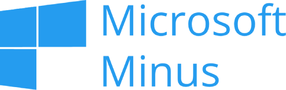

  

# Microsoft Minus
Microsoft claims its interface is "SIMPLE", the reality is that its graphical interfaces are garbage full of banners, popups and buttons that you will never press in your whole life.

Thats why Microsoft Minus exists.

Microsoft Minus is a list of filters for uBlock to block the ridiculous amount of distracting elements that Microsoft web applications have.

Here are some examples:

|Before|After|
|---|---|
|||
|||
|||

This affects Bing, Documentation Sites, Forums, Office, Sharepoint, OneDrive, Power Bi, Power Apps, Power Automate, etc ...

Microsoft Minus will (try to):
- Remove "Related Search", "You may interest", "For you", etc...
- Remove "Feedback", "Help", "What's new", etc... buttons
- Remove overlays and other visual effects
- Remove anything related to AI
- Remove annoying popups
- Remove Bing rewards
- Remove banners
- Remove animations (You will need to use Stylus)

## How to use
It's very easy.
1. Install uBlock Origin in your web browser (https://github.com/gorhill/uBlock)
2. Go to uBlock's control panel > My Filters
3. Select "Import and append"
4. Import mm.txt

## Build your filter list
Inside the generate directory you have a list of files where you can add your own filters, then run build.py to merge all the files and generate a new filter list.

## Bonus CSS
mm.css a stylesheet that will improve the look of Microsoft websites and remove animations.
1. Install Stylus in your web browser (https://github.com/openstyles/stylus)
2. Import mm.css in Stylus

## Notes
This file is not perfect, is incomplete, and will probably become obsolete as the time passes.

There are some elements that probably won't be blocked depending of the language.

Use uBlock "block element" feature to improve your list of blocked elements, and share it if you want.

## One more thing
This help is for those who are being forced to use Microsoft applications, if no one is forcing you to use Microsoft applications the best thing you can do is switch to free and open source alternatives and never look back.